# BooCax-RK3399 系统移植指南

**作者：** HankLiu2020

## 📦 资源下载

本文中提到的所有资源文件（原厂镜像、目标系统、工具等）已打包上传：

**夸克网盘：** https://pan.quark.cn/s/52deb9722ffe?pwd=AFLA
**提取码：** `AFLA`

---

## 概述 👓

最近入手了一块双网口 RK3399 开发板，但卖家未提供任何技术资料。作为第一次接触 RK 系列芯片的新手，我决定从零开始摸索这块板子的使用方法。本文记录了完整的移植过程，希望能为遇到类似情况的朋友提供参考

### 硬件照片

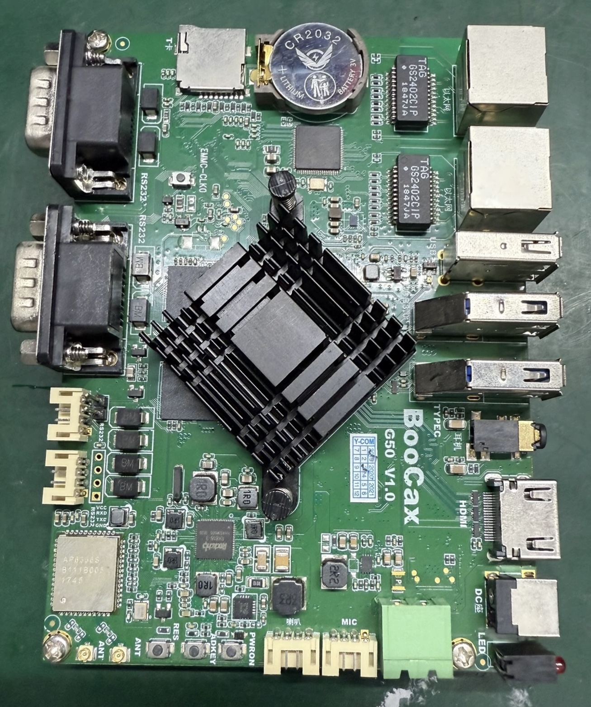

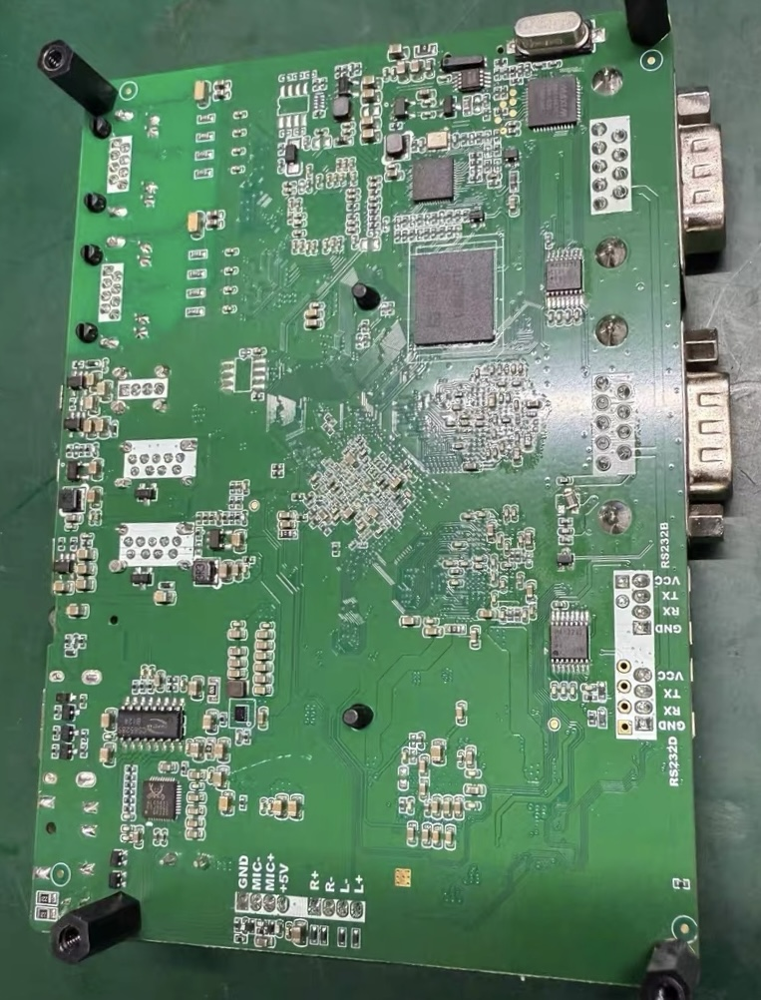

### 硬件配置

**基本信息：**
- 板卡标识：BooCax（丝印）
- 主控芯片：Rockchip RK3399
- 内存：4GB RAM
- 存储：32GB eMMC

**网络芯片：**
- RTL8367（千兆交换机芯片）
- RTL8211（千兆以太网 PHY）
- 双网络变压器

**接口：**
- 双千兆以太网口
- USB 3.0 接口
- USB 2.0 接口
- 音频接口

由于缺少官方技术文档，以下记录了完整的系统移植探索过程


## 进入 Loader/MaskROM 模式

RK3399 芯片支持通过硬件按键组合进入 Loader 或 MaskROM 模式。

### 所需硬件
- USB A-A 数据线（需要质量可靠的线缆）

### 进入 Loader 模式
Loader 模式主要用于备份原厂分区数据。

**操作步骤：**
1. 使用 USB A-A 线连接开发板与电脑
2. 开发板上电
3. 长按板子上的 **ADKEY** 按键
4. 按下 **RES** 复位键
5. 此时开发板进入 Loader 模式，可以进行原厂分区的备份

### 进入 MaskROM 模式
MaskROM 模式主要用于烧录新系统。

**操作步骤：**
1. 使用 USB A-A 线连接开发板与电脑
2. 开发板上电
3. 长按板子上的 **EMMC_CLK0** 按键
4. 按下 **RES** 复位键
5. 此时开发板进入 MaskROM 模式，可以烧录新系统

## 串口调试

### 串口位置与接线

板载 WiFi 网卡旁边标注为 **RS232D** 的插针为 TTL 串口，接线方式如下：

| 开发板 | USB转TTL模块 |
|--------|-------------|
| GND    | GND         |
| RX     | TX          |
| TX     | RX          |

### 连接参数
- 转换芯片：CH340（已测试可用）
- 波特率：**1500000** (1.5M)

### 串口输出示例

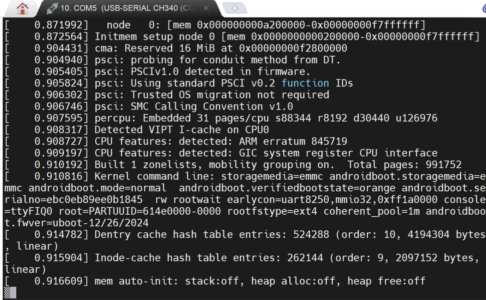

通过串口可以查看完整的启动日志，对于调试系统启动问题非常有用

## 系统移植

系统移植的核心思路：选择硬件配置相似的开发板系统作为基础，然后提取原厂的设备树（DTB）信息，将二者结合以适配本板。

### 步骤 1：选择并下载目标系统

经过多次尝试，选择了 FriendlyARM Nano3399 的系统（IO 配置相似）：

**下载链接：**
[update-nano-rk3399-2004-ubuntu-hdmi-20241226-101915.zip](https://files.kos.org.cn/rockchip/nano3399/update-nano-rk3399-2004-ubuntu-hdmi-20241226-101915.zip)

**系统信息：**
- 基于 Ubuntu 20.04 for ARM
- 为 Nano3399 编译
- 默认用户名和密码相同

**解包固件：**

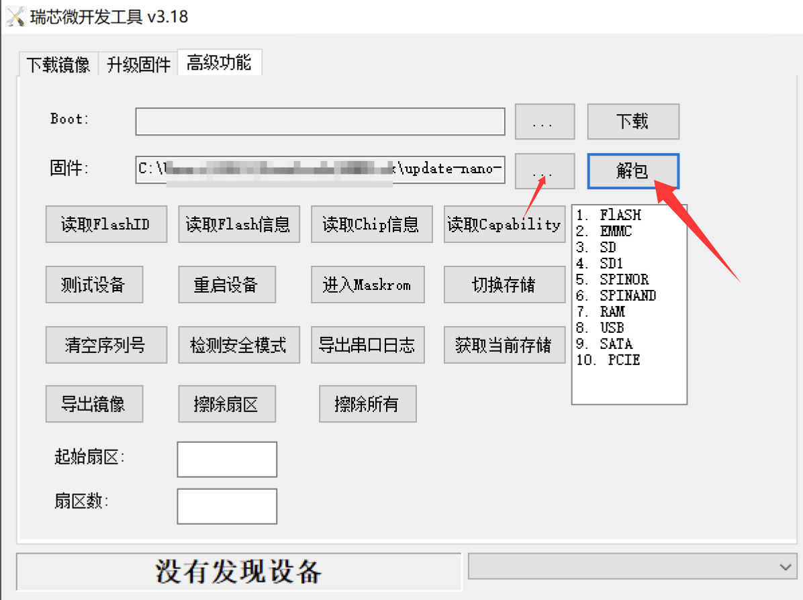

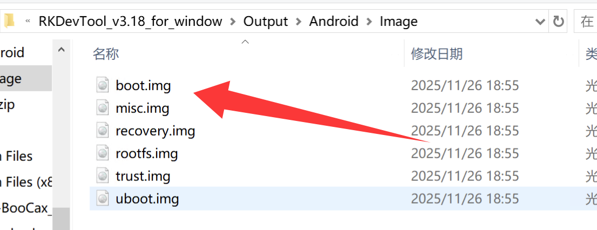

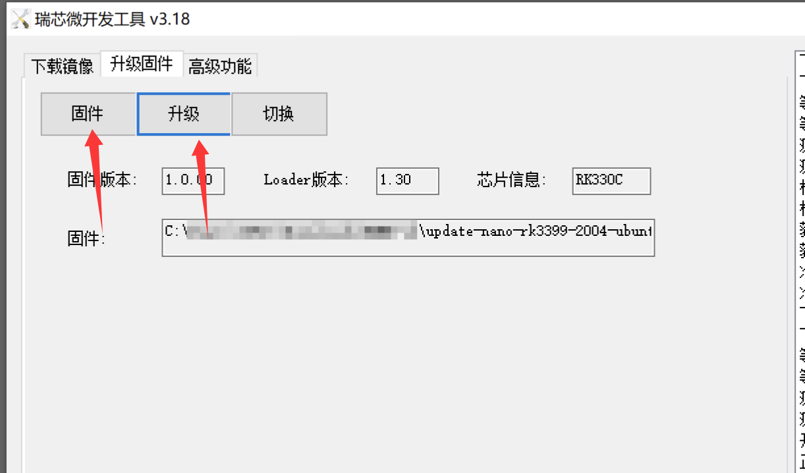

使用 RKDevTool 载入系统镜像并解包，得到各个分区文件。提取 `boot.img` 备用。

**初步测试结果：**

将完整固件烧录到开发板后：
- ✅ HDMI 显示正常
- ❌ USB3、网卡、LED 均无法正常工作

原因：设备树不匹配，需要提取原厂设备树进行适配

### 步骤 2：备份原厂镜像

⚠️ **重要提示：强烈建议在进行任何操作前，先备份原厂固件！**

**操作方法：**
1. 让开发板进入 Loader 模式
2. 使用 RKDevTool 按照 Loader 中读取到的地址备份各个分区
3. 保存为 `BooCax_original_img.zip`

**说明：**
- 原厂系统虽然无法启动（TTL 显示卡在挂载 rootfs），但可以提供宝贵的设备树信息
- 备份时请仔细核对 eMMC 地址，避免读取错误的区域
- 建议自己也备份一份，以防本文档的地址有误

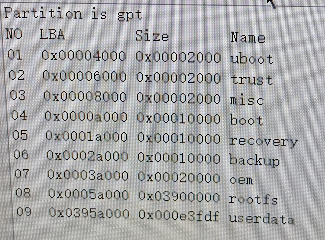

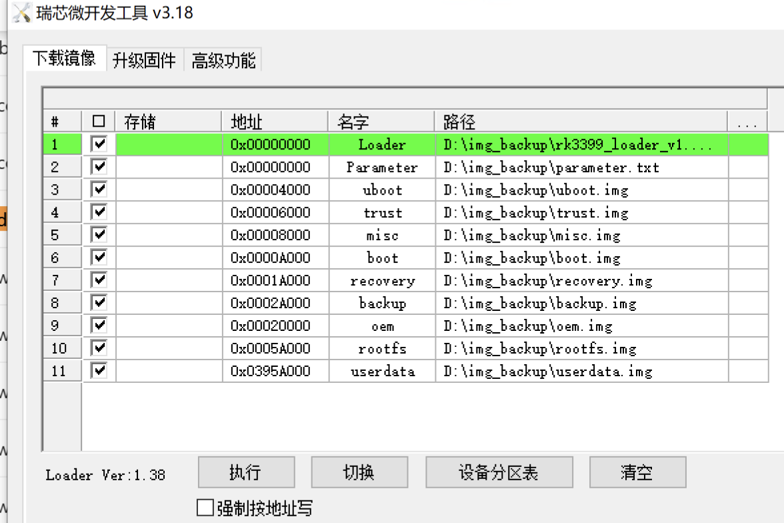

**恢复原厂固件：**

如需恢复原厂系统，可使用提供的 config 配置文件，在 RKDevTool 中点击"执行"即可刷写

### 步骤 3：提取并修改设备树（DTB）

从原厂 `boot.img` 中提取设备树文件：

**1. 提取 DTB：**

```bash
git clone https://github.com/PabloCastellano/extract-dtb
cd extract-dtb
python extract-dtb.py ../boot.img
```

输出文件：`01_dtbdump_rockchip,rk3399-excavator-linux.dtb`

**2. 反编译 DTB 为 DTS（在 WSL/Linux 中进行）：**

```bash
dtc -I dtb -O dts -o rk3399-excavator.dts 01_dtbdump_rockchip,rk3399-excavator-linux.dtb
#原系统的dts存档为rk3399-excavator - original.dts
#此时可以对dts进行修改，以适配迁移的目标系统
#我修改的dts结果名为nano-rk3399-new.dts，尝试适配到Ubuntu20.04

#修改后编译dts为新dtb
dtc -I dts -O dtb -o nano-rk3399.dtb nano-rk3399.dts
#存档名为new_nano-rk3399.dtb
```

**说明：**
- 第一步反编译生成 `rk3399-excavator.dts`，建议保存为 `rk3399-excavator-original.dts` 作为备份
- 根据需要修改 DTS 文件以适配 Ubuntu 20.04 系统
- 修改完成后重新编译为 DTB 文件

### 步骤 4：重新打包 boot.img

**1. 解包目标系统的 boot.img：**

```bash
git clone https://github.com/xiaolu/mkbootimg_tools
cd mkbootimg_tools/

#解包boot.img
./mkboot ../boot.img ../boot

#此时输出：
Unpack & decompress ../boot.img to ../boot
  kernel         : kernel
  ramdisk        : ramdisk
  page size      : 2048
  kernel size    : 44452352
  ramdisk size   : 0
  second_size    : 142848
  base           : 0x10000000
  kernel offset  : 0x00008000
  ramdisk offset : 0xf0000000
  second_offset  : 0x00f00000
  tags offset    : 0x00000100
  cmd line       :
ramdisk is unknown format,can't unpack ramdisk
Unpack completed.
#注意，本ROM的ramdisk并没有解包成功

#这时候会输出一个文件夹，文件夹里second.img就是resource.img
```

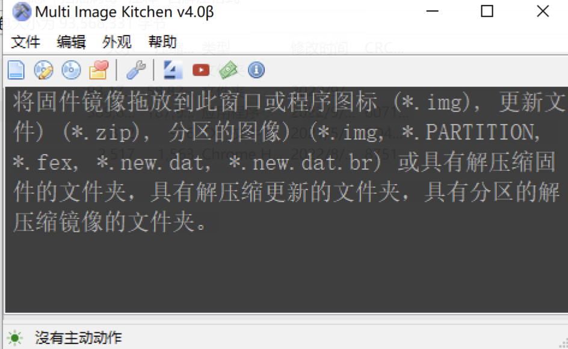

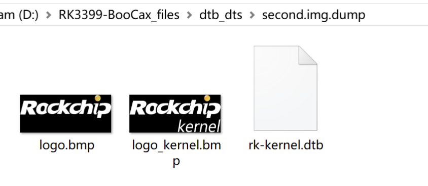

**2. 替换 DTB 文件：**

使用 **resource_tool（MIK工具）** 解包 `resource.img`（即 `second.img`），会得到包含两张图片和一个 DTB 的文件夹。

操作步骤：
1. 将上一步生成的 `new_nano-rk3399.dtb` 重命名为 `rk-kernel.dtb`
2. 替换 resource 文件夹中的 DTB 文件
3. 使用 resource_tool 重新打包为 `second.img`

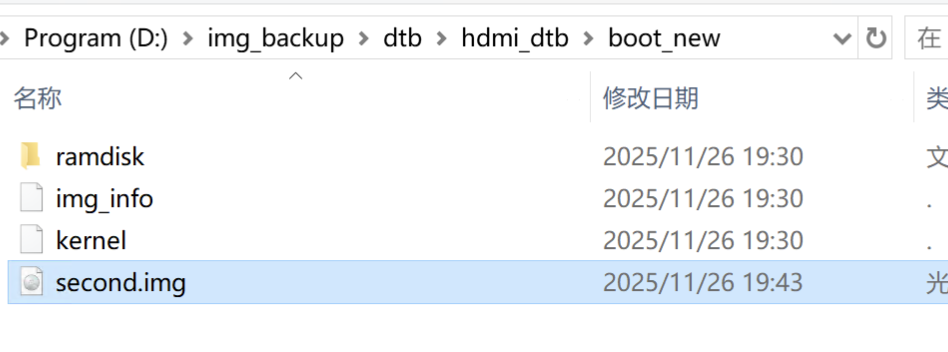

**3. 重新打包 boot.img：**

将新的 `second.img` 放回解包目录，然后重新打包：

```bash
./mkboot ../boot ../boot_new.img
#输出如下
mkbootimg from ../boot/img_info.
  kernel         : kernel
  ramdisk        : new_ramdisk
  page size      : 2048
  kernel size    : 44452352
  ramdisk size   : 62
  second_size    : 142848
  base           : 0x10000000
  kernel offset  : 0x00008000
  ramdisk offset : 0xf0000000
  second_offset  :
  tags offset    : 0x00000100
  cmd line       :
ramdisk is gzip format.
Kernel size: 44452352, new ramdisk size: 62, boot_new.img: 44596674.
boot_new.img has been created.
```

至此，得到了包含新设备树的 `boot_new.img`

### 步骤 5：烧录新的 boot.img

**1. 让开发板进入 MaskROM 模式**（参考前文步骤）

**2. 使用 RKDevTool 烧录：**

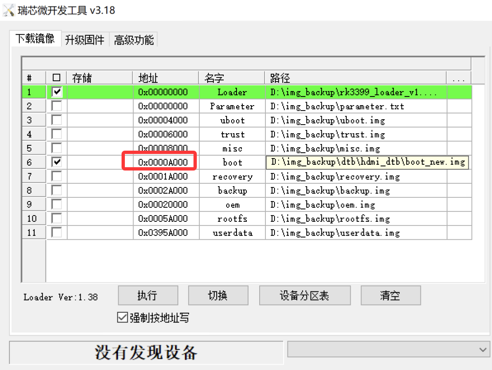

烧录设置：
- 勾选左侧复选框以启用该分区的烧录
- 设置正确的 boot 分区地址（通常为 `0x00008000`）
- 选择新生成的 `boot_new.img` 文件
- 如果提示地址溢出，勾选 **"强制按地址写"** 选项

**3. 等待烧录完成，重启系统**

## 移植成功 🎉

经过上述步骤，成功将 Ubuntu 20.04 ARM 系统移植到 BooCax RK3399 开发板！

### 功能测试结果

**✅ 已正常工作：**
- LED 指示灯
- USB 3.0 OTG
- USB 3.0 接口
- USB 2.0 接口
- HDMI 显示输出

**⚠️ 待改进：**
- 双网口均识别为 `eth0`（推测硬件上可能是交换机架构）

**⚠️ 待测试：**
- 2.4G WiFi 和蓝牙在 boot 时加载成功，但功能还有待测试


### 系统截图

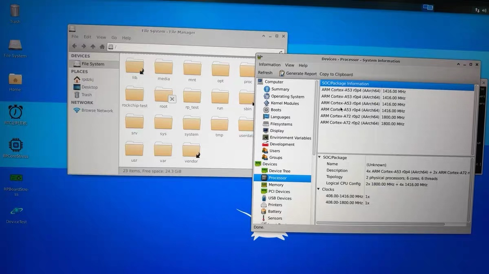


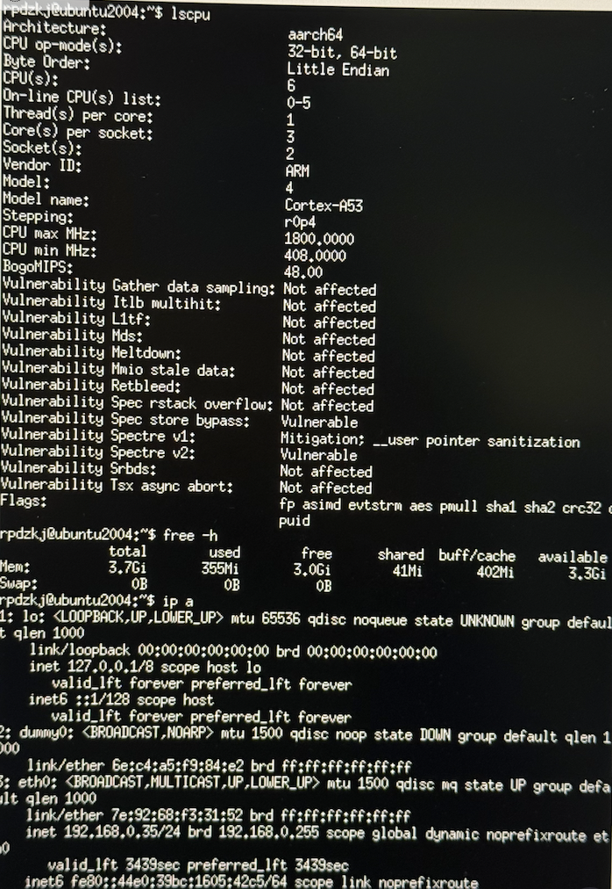

---

## 后续改进方向

- 解决双网口识别问题，是否可以实现独立的 eth0 和 eth1？
- 完善 ramdisk 的提取和打包流程
- 测试更多外设功能（音频、HDMI-IN 等）

如果你也在折腾类似的开发板，欢迎参考本文思路进行适配。有任何问题或改进建议，欢迎交流讨论！

---

## 🙏 致谢

感谢以下项目和资源的支持：

- **[FriendlyARM Nano3399](https://files.kos.org.cn/rockchip/nano3399/)** - 提供了基础系统镜像
- **[extract-dtb](https://github.com/PabloCastellano/extract-dtb)** - DTB 提取工具
- **[mkbootimg_tools](https://github.com/xiaolu/mkbootimg_tools)** - Boot 镜像打包工具

特别感谢闲鱼老板 **年丰巷辛勤的粟米** 的支持！

---

## 📄 许可证

<a rel="license" href="http://creativecommons.org/licenses/by-nc/4.0/">
  
</a>

本作品采用 [知识共享署名-非商业性使用 4.0 国际许可协议](http://creativecommons.org/licenses/by-nc/4.0/) 进行许可。

